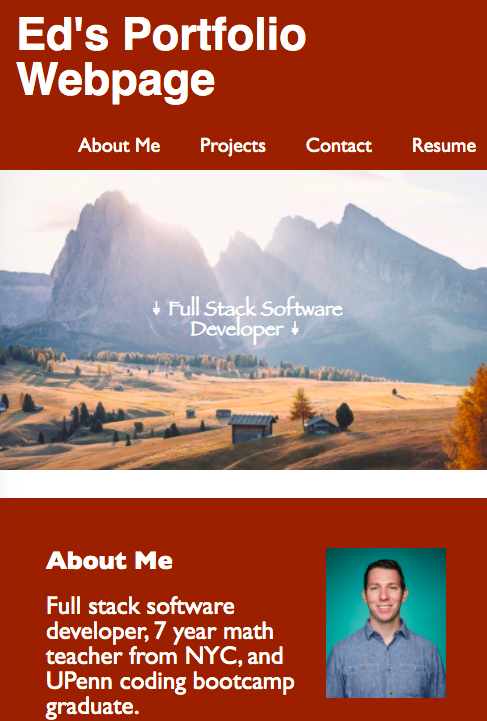

# HomeWork-2-Portfolio: Advanced CSS

## HW 2 Description
This webpage was created with the intention of informing a prospective employer about who I am, my skill sets, and my areas of interest, which are:
- JS Projects 
- EdTech tools
- Personal "for fun" full-stack projects

### The navigation bar:
- Intended to link to 4 functions within the website below.
- This website was created to be a store of information and showcase my professional aptitudes.
### The coding:
- This html and css file created a clear semantic structure that is easy for a user to follow as well as inspect the script. 
- Through this activity I learned how to properly organize an html and css file to make it easy for the end user to understand. As well as GitHub best practices.
### Responsive Web Design:
- The website is fully responsive to a variety of screen sizes.
- Additionally, When the webpage is viewed on a small enough window, the layout is modified to stack the div's instead of having them side by side. 

## Table of Contents
- [Installation](#installation)
- [Usage](#usage)
- [Credits](#credits)
- [License](#license)
## Installation
Clone or download this repository on GitHub then open "edoliva.github.io/Portfolio/" in a browser.   
## Usage
The navigation bar includes 4 links to more information regarding who I am, my skill sets, and my areas of interest. As well as a side bar with 3 areas of project interest (JS/Bootcamp activities, EdTech professional activities, and personal projects).
The images all link to external websites in a new tab based on the description.

Desktop View:

Reduced Screen View:

## Credits
Shoutout to our instructor Anthony and TA Tom! As well as everyone at Trilogy Education for making the content and grading our assignments. 

## License
© 2021 Edmond Oliva. 
Confidential and Proprietary. All Rights Reserved.
---
